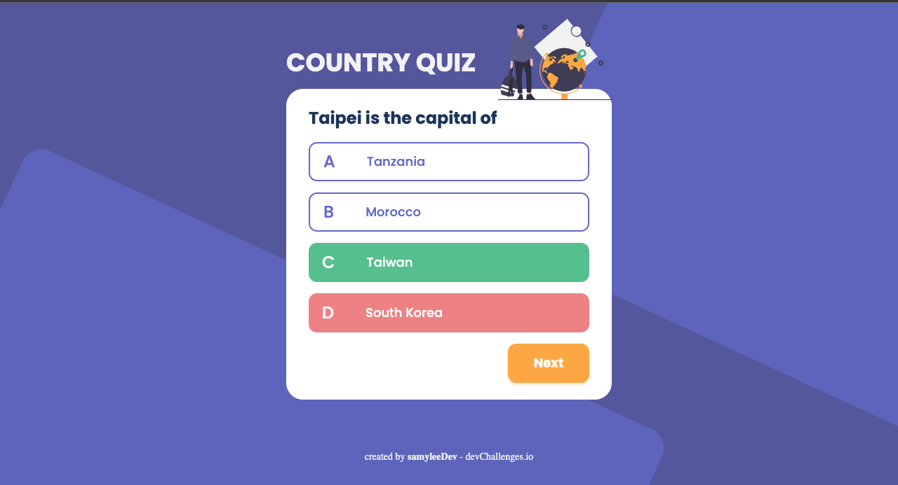
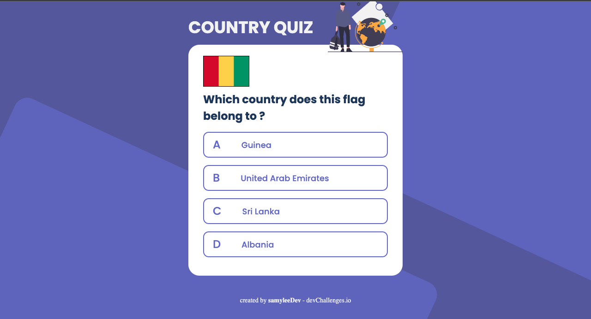
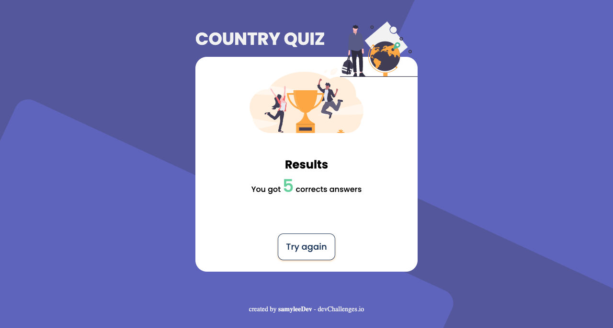

# Country Quiz (from DevChallenges.io)

## Table of contents

- [Overview](#overview)

  - [Functionalities](#functionalities)
  - [Screenshots](#screenshots)
  - [Links](#links)
  - [Built with](#built-with)

- [Installation](#installation)

- [Author](#author)

## Overview

Here is my solution for the [Devchallenges.io](https://devchallenges.io/) country quiz challenge. Find out to which country this capital or this flag belongs. But be careful, you have no right to make a mistake !

### Functionalities

- I can see at least 2 types of questions: a city is the capital of.. or a flag belong to country..
- I can see select an answer
- I can see if my answer is correct or incorrect
- When I answer correctly, I can move on to the next question
- When I answer incorrectly, I can see my results and try again
- I can try again

(User-stories directly taken from the challenge)

### Screenshots

### Links

- [Live website](https://country-quiz-master-devchallenges.vercel.app/)
- [Challenge Link](https://devchallenges.io/challenges/Bu3G2irnaXmfwQ8sZkw8)
- [Devchallenges.io](https://devchallenges.io/)

### Built with

- [React](https://reactjs.org/)
- [Redux Toolkit](https://redux-toolkit.js.org/)
- [Sass](https://sass-lang.com/)
- [Figma](https://www.figma.com/)

## Installation

1. Clone the repository.
2. In the terminal, type the instruction `npm install`.
3. Then, type `npm start`to run the app.

## Author

My portfolio : [samyleedev.fr](https://www.samyleedev.fr/)
